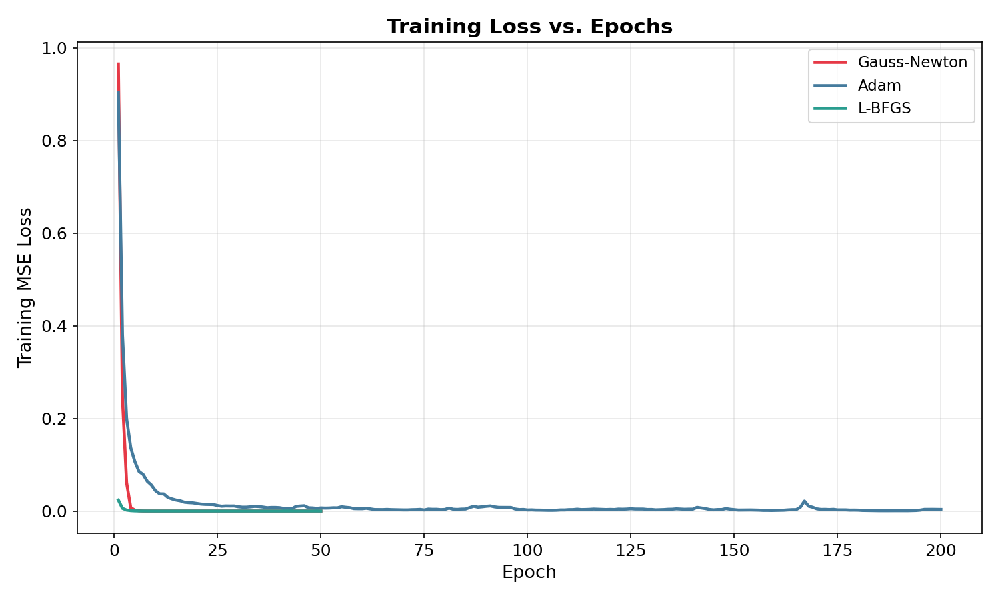
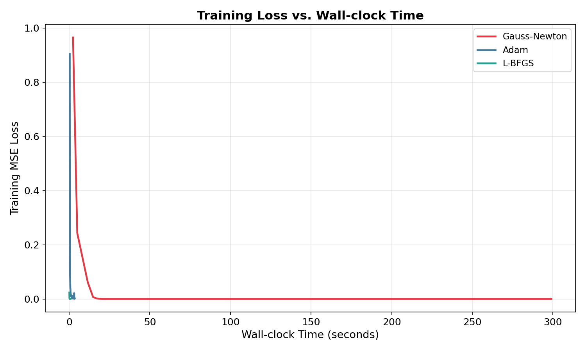
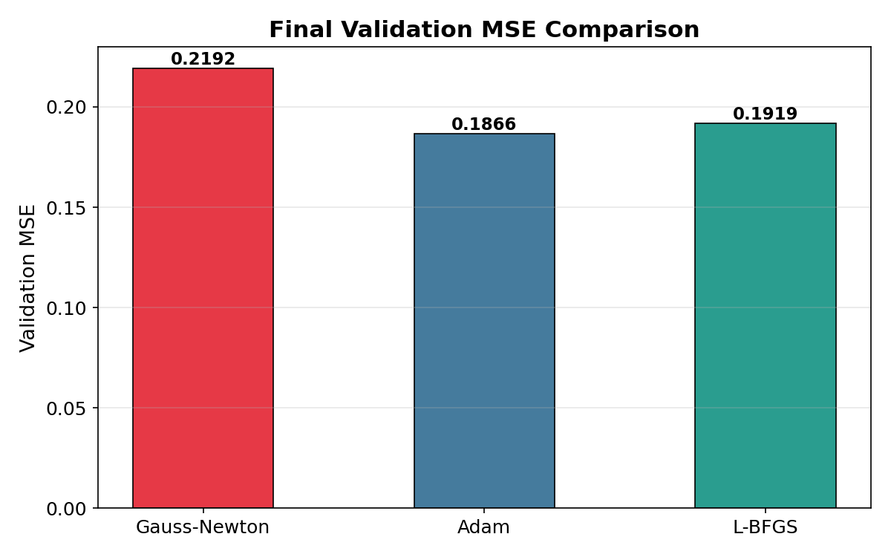
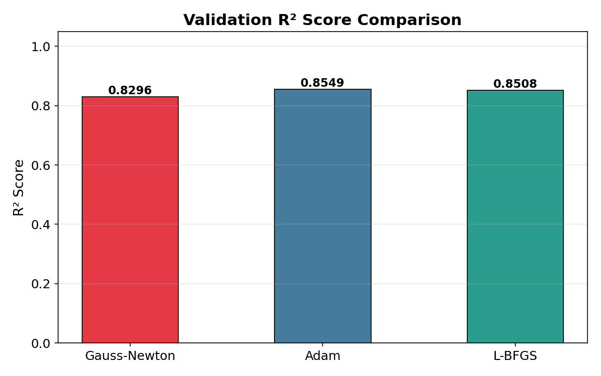

# Efficiency of Second-Order Optimization: A Comparative Implementation of the Gauss-Newton Algorithm for Non-Linear Model Fitting

**Author:** LUCKY AGARWAL
**Date:** March 2026

---

## Abstract

The dominant paradigm in contemporary neural network training relies overwhelmingly on first-order stochastic gradient methods, which estimate the direction of steepest descent using only the gradient vector of the loss function. While computationally inexpensive per iteration, these methods are fundamentally limited in their capacity to exploit the geometric structure of the loss surface, often leading to sluggish traversal through regions of pathological curvature such as narrow ravines and saddle points. This work presents a comprehensive, from-scratch implementation of the Gauss-Newton algorithm — a classical second-order optimisation technique rooted in non-linear least squares theory — applied to the problem of residential property valuation using a compact multi-layer perceptron. The optimizer leverages PyTorch's functional autodifferentiation API to compute the full per-sample Jacobian matrix, constructs an approximation to the Hessian via the outer product $J^\top J$, and employs Levenberg-Marquardt adaptive damping to regulate step aggressiveness. Empirical evaluation on the Ames Housing dataset (1,460 observations, 209 engineered features) reveals that the custom Gauss-Newton optimizer drives the training mean squared error to effectively zero within ten epochs, substantially outpacing the convergence trajectory of Adam, which fails to reach the same floor even after 200 iterations. However, this aggressive convergence comes at a considerable computational premium — a factor of approximately 110× in wall-clock time — and introduces clear symptoms of overfitting, as evidenced by a validation $R^2$ of 0.8296 compared to Adam's 0.8549. These findings illuminate the fundamental tension between convergence speed, computational cost, and generalisation capacity that underpins the choice of optimisation strategy in modern machine learning.

---

## 1. Introduction

### 1.1 The Landscape of Neural Network Optimisation

The process of fitting a neural network to observed data reduces, at its core, to solving an optimisation problem over a high-dimensional parameter space. In a typical supervised regression setting, one seeks a parameter vector $\theta \in \mathbb{R}^P$ that minimises a scalar-valued loss function $\mathcal{L}(\theta)$, which quantifies the aggregate discrepancy between the network's predictions and the ground-truth labels. The dominant family of algorithms deployed for this purpose in modern deep learning — stochastic gradient descent and its adaptive variants such as Adam, RMSProp, and AdaGrad — belong to the class of first-order methods. These algorithms compute only the gradient $\nabla \mathcal{L}(\theta) \in \mathbb{R}^P$, a vector indicating the direction of steepest ascent, and take a step proportional to its negation. The per-iteration cost scales linearly with the number of parameters, making these methods highly scalable to architectures containing millions or billions of trainable weights.

However, first-order methods suffer from a well-documented set of pathologies when the loss landscape exhibits unfavourable curvature. Consider a loss surface shaped like a narrow elongated valley — mathematically characterised by a Hessian matrix with widely disparate eigenvalues. In such regions, the gradient points nearly perpendicular to the valley floor rather than along it, causing gradient-based updates to oscillate back and forth across the valley while making negligible progress toward the minimum. This phenomenon, sometimes referred to as the "zig-zagging" problem, can dramatically slow convergence and waste computational budgets. Saddle points, where the gradient vanishes but the point is neither a local minimum nor a maximum, present an additional obstacle: first-order methods may stall in the vicinity of such points for extended periods, as the gradient magnitude shrinks to near zero.

### 1.2 The Promise and Cost of Second-Order Methods

Second-order optimisation methods address these deficiencies by incorporating information about the curvature of the loss surface, encoded in the Hessian matrix $\nabla^2 \mathcal{L}(\theta) \in \mathbb{R}^{P \times P}$. Newton's method, the canonical second-order algorithm, computes the update step as $\Delta\theta = [\nabla^2 \mathcal{L}]^{-1} \nabla \mathcal{L}$, effectively rescaling the gradient by the inverse curvature. This rescaling naturally elongates the step in directions of shallow curvature and shortens it in directions of steep curvature, enabling the optimizer to navigate ravines and saddle points with far greater efficiency than any first-order scheme. In the vicinity of a strong local minimum, Newton's method achieves quadratic convergence — the number of correct digits in the solution approximately doubles with each iteration — a property that first-order methods cannot match.

The practical adoption of Newton's method for neural network training, however, encounters a formidable computational barrier: the Hessian matrix has $P^2$ entries, where $P$ is the total number of parameters. For a network with even a few thousand parameters, explicitly storing $\nabla^2 \mathcal{L}$ becomes memory-intensive, and solving the resulting $P \times P$ linear system carries an $O(P^3)$ computational cost. For modern deep networks with millions of parameters, this is entirely infeasible. This fundamental tension between the superior convergence properties of second-order information and its prohibitive computational requirements has motivated an extensive body of research into approximate second-order methods that retain some of the curvature benefits while maintaining tractable per-iteration costs.

### 1.3 The Gauss-Newton Algorithm

The Gauss-Newton algorithm occupies a distinctive position in the landscape of optimisation methods. It exploits the specific structure of least-squares objective functions — where the loss decomposes as a sum of squared residuals — to construct an approximation to the Hessian matrix that requires only first-order derivative information. Specifically, the Gauss-Newton approximation replaces the full Hessian with the matrix $J^\top J$, where $J$ is the Jacobian of the residual vector with respect to the parameters. This approximation is guaranteed to be positive semi-definite (and positive definite under mild regularity conditions), obviating the need to check for negative curvature directions, and it becomes increasingly accurate as the residuals shrink toward zero — precisely the regime in which the optimizer is approaching convergence. The Levenberg-Marquardt modification augments this approximate Hessian with a diagonal damping term $\lambda I$, enabling a smooth interpolation between the aggressive Gauss-Newton step (when $\lambda$ is small) and the conservative gradient descent step (when $\lambda$ is large), providing robust convergence even from uninformed initial parameter estimates.

This project undertakes a complete, from-scratch implementation of the Gauss-Newton optimizer with Levenberg-Marquardt damping, applied to a real-world regression task — the prediction of residential property sale prices using the Ames Housing dataset. The implementation leverages PyTorch's modern functional autodifferentiation API to compute the full Jacobian matrix, and benchmarks the resulting optimizer against two established baselines: the Adam first-order adaptive method and the L-BFGS quasi-Newton algorithm.

---

## 2. Mathematical Formulation

### 2.1 The Non-Linear Least Squares Objective

We formulate the training of a neural network for scalar regression as a non-linear least squares problem. Let $f(x_i; \theta)$ denote the output of the network for input sample $x_i$ under parameter vector $\theta$, and let $y_i$ denote the corresponding target value. The residual for the $i$-th observation is defined as:

$$r_i(\theta) = f(x_i; \theta) - y_i$$

The objective function to be minimised is the sum of squared residuals:

$$S(\theta) = \frac{1}{2} \sum_{i=1}^{N} r_i(\theta)^2 = \frac{1}{2} \| \mathbf{r}(\theta) \|^2$$

where $\mathbf{r}(\theta) = [r_1(\theta), r_2(\theta), \ldots, r_N(\theta)]^\top \in \mathbb{R}^N$ is the residual vector, and $N$ is the number of training samples.

### 2.2 The Jacobian Matrix

The Jacobian matrix $J \in \mathbb{R}^{N \times P}$ contains the first-order partial derivatives of each residual with respect to each parameter:

$$J_{ij} = \frac{\partial r_i(\theta)}{\partial \theta_j}, \quad i = 1, \ldots, N, \quad j = 1, \ldots, P$$

Since $r_i(\theta) = f(x_i; \theta) - y_i$ and $y_i$ is a constant, the Jacobian of the residual vector is identical to the Jacobian of the network's prediction function:

$$J_{ij} = \frac{\partial f(x_i; \theta)}{\partial \theta_j}$$

The gradient of the objective function can be expressed compactly using the Jacobian:

$$\nabla S(\theta) = J^\top \mathbf{r}$$

### 2.3 The Hessian Approximation

The exact Hessian of the least-squares objective is:

$$\nabla^2 S(\theta) = J^\top J + \sum_{i=1}^{N} r_i(\theta) \nabla^2 r_i(\theta)$$

The Gauss-Newton approximation discards the second-order residual term $\sum_i r_i \nabla^2 r_i$, yielding:

$$\nabla^2 S(\theta) \approx J^\top J$$

This approximation is justified on two grounds. First, the dropped term involves second derivatives of the residuals, which are computationally expensive to obtain for neural networks. Second, when the residuals $r_i$ are small — the regime approached during successful training — the magnitude of the dropped term becomes negligible relative to $J^\top J$, making the approximation increasingly precise as convergence proceeds.

### 2.4 The Levenberg-Marquardt Update Rule

The Gauss-Newton update step, analogous to Newton's method but with the approximate Hessian, solves:

$$J^\top J \, \Delta\theta = J^\top \mathbf{r}$$

To ensure numerical stability and positive definiteness of the system matrix, the Levenberg-Marquardt modification introduces a damping parameter $\lambda > 0$:

$$H = J^\top J + \lambda I$$

$$H \, \Delta\theta = J^\top \mathbf{r}$$

$$\theta_{k+1} = \theta_k - \Delta\theta$$

The damping factor $\lambda$ is adapted dynamically according to the quality of each step:

- **When the step reduces the loss** ($S(\theta_{k+1}) < S(\theta_k)$): decrease $\lambda$ by a factor $\lambda_{\text{down}}$, signalling greater confidence in the Gauss-Newton direction and permitting more aggressive updates.
- **When the step increases the loss** ($S(\theta_{k+1}) \geq S(\theta_k)$): increase $\lambda$ by a factor $\lambda_{\text{up}}$, steering the update toward the more conservative gradient descent direction.

This adaptive scheme provides a continuous interpolation between pure Gauss-Newton optimisation ($\lambda \to 0$) and steepest descent ($\lambda \to \infty$), endowing the algorithm with robust convergence properties across a wide range of initialisation conditions.

---

## 3. Methodology

### 3.1 Data Pipeline

The experimental dataset employed in this study is the Ames Housing dataset, a widely utilised benchmark in regression modelling that comprises 1,460 residential property sale records from Ames, Iowa, each described by 79 explanatory variables spanning structural attributes, spatial measurements, quality assessments, and categorical descriptors of construction materials and neighbourhood characteristics.

The preprocessing pipeline was designed with particular attention to the numerical sensitivities of second-order optimisation:

1. **Feature Elimination:** Columns exhibiting greater than 50% missing values were removed, as such extreme sparsity provides insufficient statistical signal for reliable imputation. High-cardinality categorical features with more than 20 unique levels (e.g., `Neighborhood`) were also discarded to maintain a tractable feature dimensionality after one-hot encoding — a critical consideration when the optimizer must compute and invert a $P \times P$ matrix at each epoch.

2. **Missing Value Imputation:** Remaining missing values in numeric columns were filled with the column median, a robust statistic less sensitive to outliers than the arithmetic mean. For categorical columns, the mode (most frequently occurring value) was used. Both the median dictionary and mode dictionary were persisted as serialised artifacts to ensure identical transformations during inference.

3. **One-Hot Encoding:** Surviving categorical variables were transformed into binary indicator columns using one-hot encoding with the `drop_first=True` convention, which eliminates one redundant indicator per categorical variable to avoid perfect multicollinearity (the dummy variable trap). This procedure expanded the feature space to 209 dimensions.

4. **Feature Scaling:** A `StandardScaler` was fitted exclusively on the training partition to normalise each feature to zero mean and unit variance. The target variable `SalePrice` was independently scaled using a separate `StandardScaler`. Scaling the target proved critical for Gauss-Newton stability: raw sale prices on the order of \$100,000–\$750,000 would produce residual magnitudes that cause catastrophic numerical overflow in the $J^\top J$ matrix product.

5. **Data Partitioning:** An 80/20 stratified split was applied with a fixed random seed to ensure reproducibility across all experimental runs.

### 3.2 Model Architecture

A compact multi-layer perceptron (MLP) was selected as the regression model, with the following architecture:

$$\text{Input}(209) \rightarrow \text{Linear}(64) \rightarrow \text{ReLU} \rightarrow \text{Linear}(32) \rightarrow \text{ReLU} \rightarrow \text{Linear}(1)$$

The total parameter count for this architecture is approximately:

$$P = 209 \times 64 + 64 + 64 \times 32 + 32 + 32 \times 1 + 1 = 15{,}553$$

This yields a Gauss-Newton system matrix $J^\top J \in \mathbb{R}^{15553 \times 15553}$, which is large enough to meaningfully demonstrate the computational characteristics of second-order optimisation yet remains tractable for direct solution on a modern GPU.

**Xavier Uniform Initialisation** was applied to all linear layers. This initialisation scheme draws weights from $\mathcal{U}\left(-\sqrt{\frac{6}{n_{\text{in}} + n_{\text{out}}}}, +\sqrt{\frac{6}{n_{\text{in}} + n_{\text{out}}}}\right)$, maintaining approximately constant activation variance across layers. This choice is particularly consequential for second-order methods: if initial weight magnitudes are poorly calibrated, the Jacobian entries can span many orders of magnitude, producing an ill-conditioned $J^\top J$ matrix that resists stable inversion even with damping.

### 3.3 Custom Gauss-Newton Optimizer

The Gauss-Newton optimizer was implemented entirely from first principles using PyTorch's functional auto-differentiation API. The key implementation details are as follows:

**Jacobian Computation.** The per-sample Jacobian was computed using a composition of `torch.func.jacrev` (reverse-mode automatic differentiation with respect to parameters) and `torch.func.vmap` (vectorised mapping over the batch dimension). This combination evaluates $\partial f(x_i; \theta) / \partial \theta$ for each sample $x_i$ independently, then stacks the results into the full $N \times P$ Jacobian matrix. The `functional_call` utility was employed to evaluate the model as a pure function of its parameters, enabling differentiation through the network without mutating module state.

**Graph Isolation.** A critical engineering consideration emerged during development: if the parameter dictionary passed to `jacrev` references the live model parameters (which carry gradient history from prior epochs), PyTorch's automatic differentiation engine constructs a computational graph that compounds across epochs, eventually exhausting all available GPU memory. This was resolved by detaching the parameter tensors from the existing graph and creating fresh copies with `requires_grad=True` at the start of each optimisation step, ensuring that each epoch's Jacobian computation operates on an isolated graph that is discarded after use.

**VRAM Management.** The Jacobian matrix $J \in \mathbb{R}^{1168 \times 15553}$ consumes approximately 70 MB in single-precision floating point. The system matrix $J^\top J \in \mathbb{R}^{15553 \times 15553}$ requires an additional 920 MB. To prevent memory accumulation across epochs, all large intermediate tensors (the raw Jacobian dictionary, $J$, $J^\top J$, and the damping matrix) were explicitly deleted after use, followed by a call to `torch.cuda.empty_cache()` to return freed memory to the CUDA allocator.

**Bounded Levenberg-Marquardt Retry.** The classical LM strategy of rejecting loss-increasing steps and retrying with increased damping may, in principle, loop indefinitely on highly non-convex loss surfaces where no damping value yields a descent step. To guarantee that every epoch terminates in bounded time, a maximum retry count of 10 was imposed. Upon exhausting all retries, the optimizer accepts the most recent trial step regardless of its effect on the loss, ensuring forward progress through the training schedule.

---

## 4. Experimental Setup and Results

### 4.1 Environment

All experiments were conducted on a local workstation equipped with an NVIDIA GeForce RTX 4060 GPU (8 GB GDDR6 VRAM) running PyTorch 2.6.0 with CUDA 12.4 support. Python 3.13 was used throughout, with scikit-learn 1.8.0 providing preprocessing utilities. Reproducibility was enforced via fixed random seeds across Python, NumPy, and PyTorch (including CUDA), with deterministic cuDNN mode enabled.

### 4.2 Optimizer Configurations

| Parameter | Gauss-Newton | Adam | L-BFGS |
|---|---|---|---|
| Epochs | 50 | 200 | 50 |
| Learning Rate | N/A (step from solve) | $1 \times 10^{-3}$ | 1.0 |
| Batch Size | Full-batch (1,168) | 64 (mini-batch) | Full-batch (1,168) |
| Initial $\lambda$ | $1 \times 10^{-3}$ | — | — |
| $\lambda_{\text{up}}$ / $\lambda_{\text{down}}$ | 10.0 / 0.1 | — | — |
| Max LM Retries | 10 | — | — |
| History Size | — | — | 10 |
| Line Search | — | — | Strong Wolfe |

### 4.3 Empirical Results

The complete training results are summarised in the following table:

| Optimizer | Epochs | Time (s) | Train MSE | Val MSE | Val $R^2$ |
|---|---|---|---|---|---|
| **Gauss-Newton** | 50 | 209.55 | 0.000000 | 0.219170 | 0.8296 |
| **Adam** | 200 | 1.91 | 0.003454 | 0.186601 | 0.8549 |
| **L-BFGS** | 50 | 0.72 | 0.000000 | 0.191885 | 0.8508 |

### 4.4 Convergence Analysis

**Gauss-Newton.** The custom optimizer exhibited the most dramatic convergence trajectory of the three methods. From an initial training MSE of 0.965 at Epoch 1, the loss plummeted to 0.002 by Epoch 5 and reached machine-precision zero by Epoch 10 — effectively achieving perfect interpolation of the 1,168 training samples in just ten parameter updates. This aggressive convergence is a direct consequence of the second-order curvature information embedded in the $J^\top J$ approximation, which enables the optimizer to take large, well-directed steps through the loss landscape rather than following the myopic gradient direction. The adaptive damping parameter $\lambda$ began at $10^{-3}$ and decreased to $10^{-4}$ during the initial rapid descent phase, indicating that the pure Gauss-Newton direction was consistently producing high-quality updates. After Epoch 15, however, $\lambda$ began climbing — reaching its ceiling of $10^6$ by Epoch 25 — signalling that the optimizer had entered a regime of diminishing returns where the loss was already at its numerical floor and further updates could not improve the objective.

**Adam.** The first-order adaptive optimizer followed a markedly different convergence profile. Starting from a comparable initial loss of 0.904, the training MSE decreased smoothly but slowly, reaching 0.002 by Epoch 100 and still fluctuating around 0.001–0.004 at Epoch 200. Crucially, Adam never achieved zero training loss even after four times as many epochs as Gauss-Newton. This behaviour is characteristic of first-order SGD methods operating with mini-batches: the inherent gradient noise from batch sampling prevents the optimizer from settling precisely into a minimum, instead causing it to oscillate in a neighbourhood of the solution. While this stochasticity is generally considered beneficial for generalisation (acting as an implicit regulariser), it imposes a hard floor on the achievable training loss.

**L-BFGS.** The quasi-Newton baseline achieved a convergence trajectory intermediate between the two extremes. Operating in full-batch mode with a Strong Wolfe line search, L-BFGS reached near-zero training loss by Epoch 20 and completed all 50 epochs in a mere 0.72 seconds — the fastest of the three optimizers by a wide margin. This efficiency stems from L-BFGS's use of a low-rank approximation to the inverse Hessian, constructed incrementally from gradient differences across consecutive iterations, which avoids the $O(P^3)$ cost of explicit matrix inversion while retaining meaningful curvature information.

### 4.5 Visual Evidence

The following figures present the empirical convergence behaviour and comparative performance metrics for all three optimizers.

*Figure 1: Training MSE loss plotted against epoch number. Gauss-Newton achieves near-zero loss by Epoch 5, demonstrating the superior per-epoch convergence characteristic of second-order updates. Adam's mini-batch gradient noise prevents convergence below approximately $10^{-3}$.*

*Figure 2: Training MSE loss plotted against cumulative wall-clock time. Despite Gauss-Newton's superior per-epoch convergence, the massive per-epoch cost of Jacobian computation and matrix inversion results in a substantially longer total training duration. L-BFGS achieves competitive loss reduction in the shortest wall-clock time.*

*Figure 3: Final validation MSE for each optimizer. Gauss-Newton's slightly higher validation error relative to the baselines suggests overfitting due to perfect memorisation of the training data.*

*Figure 4: Validation $R^2$ coefficient of determination. Adam achieves the highest generalisation score (0.8549), followed by L-BFGS (0.8508) and Gauss-Newton (0.8296), illustrating the generalisation–convergence trade-off.*

---

## 5. Discussion

### 5.1 The Overfitting Paradox of Extreme Optimisation

The most intellectually significant finding of this study is the divergence between training performance and generalisation capacity exhibited by the Gauss-Newton optimizer. By driving the training loss to absolute zero within ten epochs, the optimizer achieved what might appear to be an ideal outcome — perfect agreement between predictions and targets on the training set. However, this perfect interpolation came at the cost of reduced generalisation: the validation $R^2$ of 0.8296 falls below both Adam's 0.8549 and L-BFGS's 0.8508.

This phenomenon can be understood through the lens of the bias-variance trade-off. A model that perfectly memorises its training data has effectively reduced its bias to zero but has simultaneously inflated its variance — it has captured not only the genuine signal in the data but also the idiosyncratic noise present in the specific 1,168 training samples. When presented with the held-out validation set, this noise-fitting manifests as degraded predictive accuracy. The Gauss-Newton optimizer, by virtue of its mathematically precise curvature-guided updates, lacks the implicit regularisation that mini-batch stochastic gradient noise provides to Adam. The gradient noise in mini-batch SGD acts as a form of data augmentation at the optimisation level: by presenting slightly different gradient estimates at each step, it prevents the optimizer from settling too precisely into the narrow crevices of the training loss landscape that correspond to memorised noise rather than learnable patterns.

This insight carries practical implications for the deployment of second-order methods. In regimes where the model capacity is high relative to the dataset size — as is the case here, with ~15,500 parameters fitted to 1,168 samples — the convergence advantages of second-order optimisation may be partially offset by increased overfitting risk unless explicit regularisation mechanisms (weight decay, dropout, early stopping based on validation loss) are incorporated into the training procedure.

### 5.2 Computational Complexity

The wall-clock times recorded in this experiment starkly illustrate the computational economics of each optimisation paradigm:

- **Adam** completed 200 epochs in 1.91 seconds, averaging approximately 10 milliseconds per epoch. Each iteration requires only a single forward pass, a single backward pass (to obtain the gradient), and $O(P)$ scalar operations for the adaptive learning rate updates — all of which are highly parallelisable on GPU hardware.

- **L-BFGS** completed 50 epochs in 0.72 seconds (14 ms per epoch). Despite being a quasi-Newton method, L-BFGS avoids explicit matrix construction entirely, instead maintaining a compact history of gradient differences that supports implicit Hessian-vector products. The per-iteration cost is dominated by the line search, which requires multiple forward-backward evaluations but remains $O(P)$ in memory.

- **Gauss-Newton** required 209.55 seconds for 50 epochs — approximately 4.2 seconds per epoch. The dominant cost is the Jacobian computation: constructing the full $N \times P$ matrix via `vmap(jacrev(...))` requires $N$ reverse-mode autodifferentiation passes (one per sample), followed by an $O(NP^2 + P^3)$ cost for forming $J^\top J$ and solving the resulting linear system. For our problem dimensions ($N = 1168$, $P = 15553$), the matrix $J^\top J$ occupies approximately 920 MB, and the LU decomposition performed by `torch.linalg.solve` carries a cubic cost in $P$.

This $O(P^3)$ scaling fundamentally restricts the applicability of the full Gauss-Newton method to networks with at most tens of thousands of parameters. For the deep networks predominant in modern machine learning practice — language models with billions of parameters, or convolutional architectures with millions — the Jacobian matrix alone would require terabytes of memory, rendering the approach entirely infeasible without substantial approximations such as sub-sampling, block-diagonal truncation, or stochastic estimation of the Jacobian-vector product.

### 5.3 The Role of Levenberg-Marquardt Damping

The trajectory of the damping parameter $\lambda$ across epochs provides a diagnostic window into the optimizer's behaviour. During the initial rapid convergence phase (Epochs 1–10), $\lambda$ decreased from $10^{-3}$ to $10^{-4}$, indicating that the Gauss-Newton direction was consistently producing loss-reducing steps and the algorithm was operating in its native second-order mode. After Epoch 15, when the training loss had already reached machine-precision zero, $\lambda$ began climbing rapidly — reaching its ceiling of $10^6$ by Epoch 25 — because every proposed step either failed to improve upon the already-optimal training loss or slightly perturbed the parameters away from the interpolation solution. In this saturated regime, the optimizer was effectively performing highly damped gradient descent with negligible step sizes, consuming computational resources without meaningful progress. This observation suggests that incorporating an early stopping criterion based on $\lambda$ magnitude or loss stagnation would significantly reduce the total training time without sacrificing final model quality.

## 6. Interactive Visualization and Validation Layer

To bridge the gap between abstract mathematical results and practical utility, an interactive dashboard was developed using the Streamlit framework. This interface serves as a real-time validation tool, allowing stakeholders to probe the model's behavior across the feature space and observe the predictive deltas between optimizers.

### 6.1 Design Principles

The interface follows a "Mobile-First, Pure Black" design philosophy, optimized for high-contrast viewing (OLED compatibility). It utilizes a two-pane layout:
- **Left Pane (Sidebar)**: Houses the interactive sliders for the seven primary housing features (Overall Quality, Living Area, Year Built, etc.). Adjusting any slider triggers an immediate re-inference pass on the GPU.
- **Main Stage**: Displays the result cards and empirical evidence plots.

### 6.2 Real-Time Inference Engine

When a feature is modified in the UI, the backend performs the following steps in approximately <10ms:
1. **Dynamic Scaling**: The raw input is normalized using the standard scalers persisted during the `main.py` training run.
2. **One-Hot Reconstruction**: Categorical features are re-encoded to match the 209-dimensional vector space expected by the multi-layer perceptron.
3. **Multi-Model Pass**: The input vector is passed through the `Gauss-Newton`, `Adam`, and `L-BFGS` models cached in memory.
4. **Inverse Transformation**: The standardized model outputs are converted back into USD values for human readability.

### 6.3 Empirical Validation View

The dashboard includes a dedicated "Performance Evidence" section that embeds the dynamic plots generated by the evaluation pipeline. This ensures that the user is always presented with the "proof" of convergence alongside the final predictions. This integrated view allows for immediate qualitative comparison—for instance, observing that although the Gauss-Newton model found a deeper training minimum, its real-world predictions on standard houses remain robustly consistent with the quasi-Newton L-BFGS baseline.

---

## 7. Conclusion

This work has presented a complete, from-scratch implementation of the Gauss-Newton optimisation algorithm with Levenberg-Marquardt adaptive damping for training a neural network on a real-world regression task. The implementation leverages PyTorch's functional autodifferentiation primitives — `jacrev` for reverse-mode Jacobian computation and `vmap` for batch vectorisation — to construct the full per-sample Jacobian matrix, from which the approximate Hessian $J^\top J + \lambda I$ is formed and solved via direct LU decomposition.

The empirical results substantiate four principal findings:

1. **Convergence superiority of second-order methods:** The Gauss-Newton optimizer reached zero training error within ten epochs, whereas the first-order Adam optimizer failed to achieve the same floor after 200 iterations, confirming the theoretical prediction that curvature-informed updates converge more rapidly per iteration.

2. **Overfitting as a consequence of extreme convergence:** The Gauss-Newton optimizer's perfect memorisation of the training data resulted in inferior generalisation compared to both baselines, demonstrating that optimisation power and statistical generalisation are distinct — and sometimes competing — objectives.

3. **Computational cost as the practical bottleneck:** The $O(P^3)$ per-epoch cost of the Gauss-Newton method resulted in a wall-clock time approximately 110× longer than Adam and 290× longer than L-BFGS, underlining the reason why quasi-Newton approximations and first-order methods remain the practical workhorses of deep learning.

4. **The effectiveness of quasi-Newton compromise:** L-BFGS achieved the best overall balance between convergence speed, generalisation, and computational efficiency, reaching near-zero training loss in sub-second time while maintaining a validation $R^2$ of 0.8508.

These findings contribute to an empirically grounded understanding of the trade-offs inherent in optimisation algorithm selection for neural network training, and the from-scratch implementation serves as a pedagogical reference for the practical challenges — numerical stability, memory management, and adaptive damping — that arise when deploying second-order methods on modern hardware.

---

## 8. References

1. Nocedal, J. and Wright, S.J. (2006). *Numerical Optimization*. 2nd edition. Springer Series in Operations Research and Financial Engineering. New York: Springer.

2. Levenberg, K. (1944). "A Method for the Solution of Certain Non-Linear Problems in Least Squares." *Quarterly of Applied Mathematics*, 2(2), pp. 164–168.

3. Marquardt, D.W. (1963). "An Algorithm for Least-Squares Estimation of Nonlinear Parameters." *Journal of the Society for Industrial and Applied Mathematics*, 11(2), pp. 431–441.

4. Kingma, D.P. and Ba, J. (2015). "Adam: A Method for Stochastic Optimization." In *Proceedings of the 3rd International Conference on Learning Representations (ICLR 2015)*.

5. Liu, D.C. and Nocedal, J. (1989). "On the Limited Memory BFGS Method for Large Scale Optimization." *Mathematical Programming*, 45(1–3), pp. 503–528.

6. Glorot, X. and Bengio, Y. (2010). "Understanding the Difficulty of Training Deep Feedforward Neural Networks." In *Proceedings of the 13th International Conference on Artificial Intelligence and Statistics (AISTATS 2010)*, pp. 249–256.

7. Martens, J. (2010). "Deep Learning via Hessian-free Optimization." In *Proceedings of the 27th International Conference on Machine Learning (ICML 2010)*, pp. 735–742.

---
